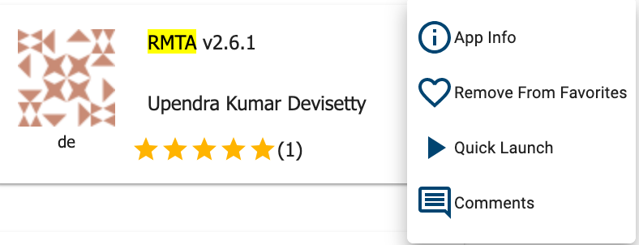
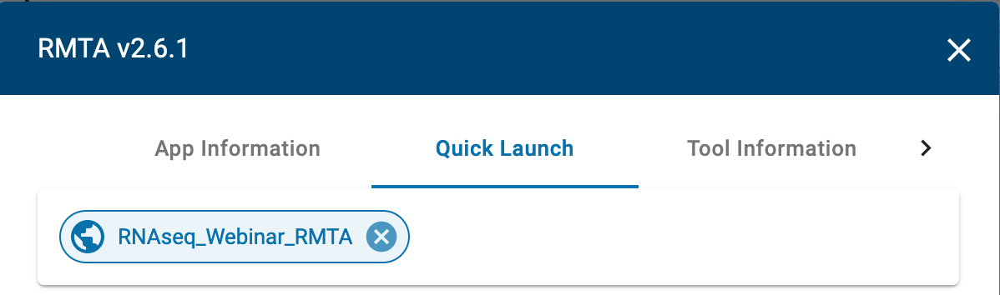
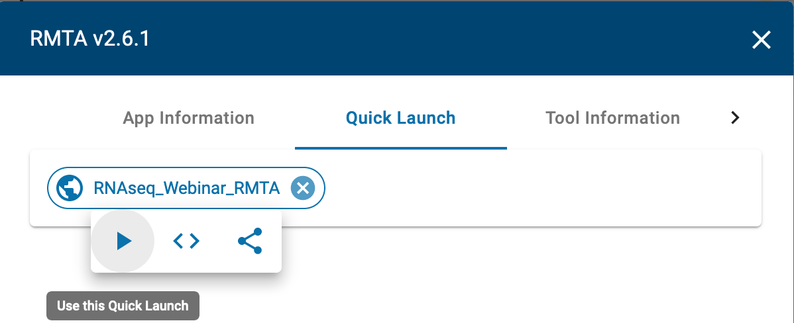
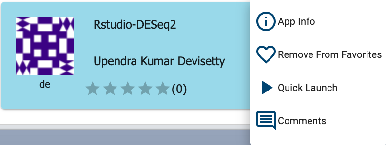
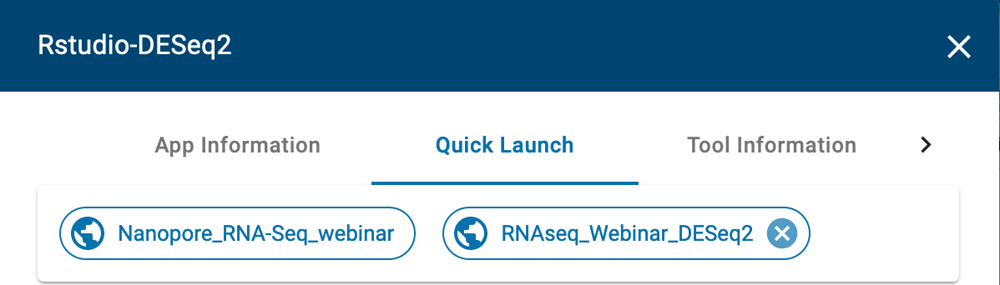
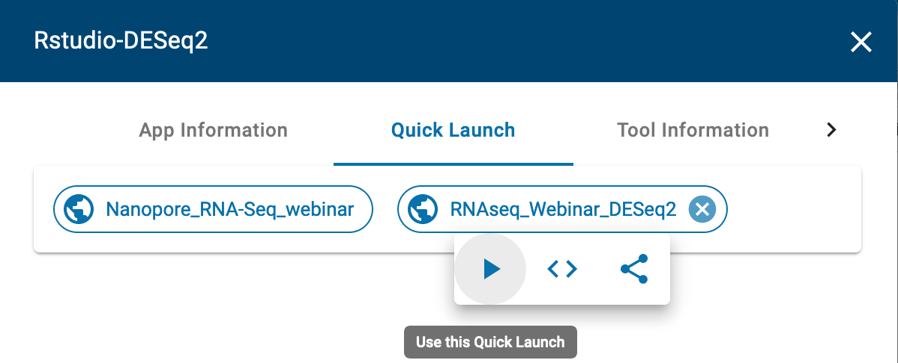

|CyVerse logo|_

|Home_Icon|_
`Learning Center Home <http://learning.cyverse.org/>`_

Quick start of RNA-seq analysis in DE
================================================

Goal
----

Perform RNAseq differential expression analysis using Read Mapping and Transcript Assembly (RMTA) and DESEq2 apps 

- Easily share results with your team, even those members without QIIME 2 installed.

- Plugin-based system — your favorite microbiome methods all in one place.

In this quick start, we will show you how to launch JupyterLab-QIIME2 VICE app in DE

.. raw:: html

    

        <iframe src="https://www.youtube.com/embed/9AT2YHkduz0" frameborder="0" allowfullscreen style="position: absolute; top: 0; left: 0; width: 100%; height: 100%;"></iframe>
    

----

Prerequisites
-------------

Downloads, access, and services
~~~~~~~~~~~~~~~~~~~~~~~~~~~~~~~

*In order to complete this tutorial you will need access to the following services/software*

	.. list-table::
	    :header-rows: 1

	    * - Prerequisite
	      - Preparation/Notes
	      - Link/Download
	    * - CyVerse account
	      - You will need a CyVerse account to complete this exercise
	      - `Register <https://user.cyverse.org/>`_

----

Platform(s)
~~~~~~~~~~~

*We will use the following CyVerse platform(s):*

.. list-table::
    :header-rows: 1

    * - Platform
      - Interface
      - Link
      - Platform Documentation
      - Learning Center Docs
    * - Discovery Environment
      - Web/Point-and-click
      - `Discovery Environment <https://de.cyverse.org/de/>`_
      - `DE Manual <https://wiki.cyverse.org/wiki/display/DEmanual/Table+of+Contents>`_
      - `Guide <https://learning.cyverse.org/projects/discovery-environment-guide/en/latest/>`__

----

*Quick Launch RMTA_v2.6.1 with test data*
---------------------------------------

Quick Launch Analysis

.. Note:: 

Click the below button for quick launch of RMTA-2.6.1 analysis
	
	|rmta-2.6.1|_

1. Login to the |discovery_enviornment|.

2. Under “Analysis Name” leave the defaults or make any desired notes.

   .. Note::

	    The quick launch feature comes pre-loaded with required files for performing read mapping and transcript assembly of the test data. All you need to do is...

3. Under "Resource Requirements" request resources as needed or leave for defaults 

4. Click **Launch Analysis**. You will receive a notification that the job has been submitted and running.

.. Note::

  You will be notified when the analysis has finished successfully.

8. Click on the "Analyses" button to display the dashboard of your analyses. Click on your RMTA anlaysis to
navigate to that analysis folder in your data store. 

.. Note::

  We will need the "feature_counts.txt" file from the "Feature_counts" folder in the "RMTA_Output" folder

----

*Launch Rstudio-DESEq2 VICE app with test script*
---------------------------------------

Quick Launch Button

.. Note::

Click the below button for quick launch of RMTA-deseq2 analysis

	|RMTA-deseq2|_
	    
1. CLick on "Apps" tab in the Discovery Enviornment and search for "Rstudio-DESeq2".

2. Click on the three dots button near the top-right corner of the app and click on "Quick Launch".

|DESeq2_quick_launch_1|_

3. Click on the "RNAseq_Webinar_DESEq2" quick launch and click on the play button to launch.

|DESeq2_quick_launch_2|_ |DESeq2_quick_launch_3|_

4. Under “Analysis Name” leave the defaults or make any desired notes.

   .. Note::

	    The quick launch feature comes pre-loaded with DESeq2 R script. All you need to do is...

5. Under "Resource Requirements" request resources as needed or leave for defaults 

6. Click **Launch Analysis**. You will receive a notification that the job has been submitted and running with the "Access your running analysis here". 

7. Clicking on the "Access your running analysis" will open the Rstudio-DESeq2 in another tab in the browser after a brief building phase.

.. Note::

  You will be asked to authenticate again to the JupyterLab with your CyVerse username and password

8. Finally, once you finish analysis, navigate to the DE tab, select the Analysis window and select the analysis, click "save and complete analysis". Upon clicking complete analysis, the analysis will be completed and all the outputs will be brought back to the analysis folder.

----

   .. Note::

	    To use our example script, navigate to *Community Data >*
	    *iplantcollaborative > example_data > RNAseq_Webinar  and select DESeq2_script.R*

Additional information, help
~~~~~~~~~~~~~~~~~~~~~~~~~~~~
- Full materials for the webinar is available `here <https://wiki.cyverse.org/wiki/display/Events/FFW%3A+Doing+metagenomic+analyses+with+QIIME+2+using+Jupyter+Notebooks+in+VICE>`_

- See the original `JupyterLab quick start <https://learning.cyverse.org/projects/vice/en/latest/user_guide/quick-jupyter.html>`_ 

- See the original `qiime2.org <https://qiime2.org>`_ for how to run qiime2 analysis

- Search for an answer: `CyVerse Learning Center <http://learning.cyverse.org>`_ or `CyVerse Wiki <https://wiki.cyverse.org>`_

- Contact CyVerse support by clicking the intercom button on the page.

----

**Fix or improve this documentation**

- On Github: `Repo link <https://github.com/CyVerse-learning-materials/fastqc_quickstart>`_
- Send feedback: `Tutorials@CyVerse.org <Tutorials@CyVerse.org>`_

----

|Home_Icon|_
`Learning Center Home`_

.. |rmta-2.6.1| image:: https://de.cyverse.org/Powered-By-CyVerse-blue.svg
.. _rmta-2.6.1: https://de.cyverse.org/de/?type=quick-launch&quick-launch-id=21524cbf-6d26-4a62-a8e6-bef731938255&app-id=ed43b8be-daf5-11e9-9393-008cfa5ae621

.. |RMTA-deseq2| image:: https://de.cyverse.org/Powered-By-CyVerse-blue.svg
.. _RMTA-deseq2: https://de.cyverse.org/de/?type=quick-launch&quick-launch-id=1444198d-068f-4cf1-a3d1-df30e6d678f2&app-id=58f9a86c-2a74-11e9-b289-008cfa5ae621

.. _RMTA_quick_launch_1: http://learning.cyverse.org/

.. _RMTA_quick_launch_2: http://learning.cyverse.org/

.. _RMTA_quick_launch_3: http://learning.cyverse.org/

.. _DESeq2_quick_launch_1: http://learning.cyverse.org/

.. _DESeq2_quick_launch_2: http://learning.cyverse.org/

.. _DESeq2_quick_launch_3: http://learning.cyverse.org/

.. |CyVerse logo| image:: ./img/cyverse_rgb.png
    :width: 500
    :height: 100
.. _CyVerse logo: http://learning.cyverse.org/
.. |Home_Icon| image:: ./img/homeicon.png
    :width: 25
    :height: 25
.. _Home_Icon: http://learning.cyverse.org/
.. |discovery_enviornment| raw:: html

    <a href="https://de.cyverse.org/de/" target="_blank">Discovery Environment</a>
