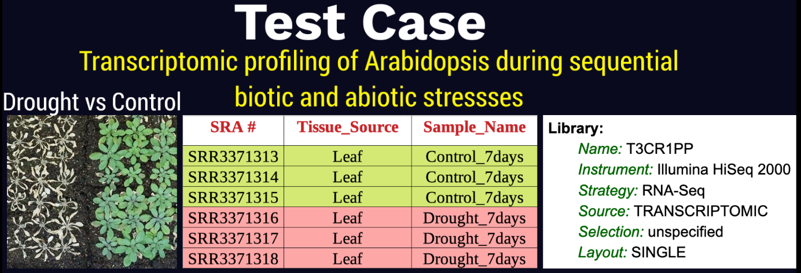

.. include:: cyverse_rst_defined_substitutions.txt
|CyVerse_logo|_

|Home_Icon|_
`Learning Center Home <http://learning.cyverse.org/>`_

Quick start of RNA-seq analysis in DE
================================================

Goal
----

Perform RNAseq differential expression analysis using Read Mapping and Transcript Assembly (RMTA) and Rstudio-DESEq2 apps 

- RMTA is a workflow that can rapidly process raw RNA-seq illumina data by mapping reads to a genome (HISAT2), assemble transcripts using Stringtie and count reads using featureCounts.

- DESeq2 is a R package to analyze count tables for differentially expressed genes, visualize the results, add extra gene annotations, and cluster samples and genes using transformed counts

In this quick start, we will show you how to launch RMTA app and Rstudio-DESeq2 VICE app in DE

----

Prerequisites
-------------

Downloads, access, and services
~~~~~~~~~~~~~~~~~~~~~~~~~~~~~~~

*In order to complete this tutorial you will need access to the following services/software*

	.. list-table::
	    :header-rows: 1

	    * - Prerequisite
	      - Preparation/Notes
	      - Link/Download
	    * - CyVerse account
	      - You will need a CyVerse account to complete this exercise
	      - `Register <https://user.cyverse.org/>`_

----

Platform(s)
~~~~~~~~~~~

*We will use the following CyVerse platform(s):*

.. list-table::
    :header-rows: 1

    * - Platform
      - Interface
      - Link
      - Platform Documentation
      - Learning Center Docs
    * - Discovery Environment
      - Web/Point-and-click
      - `Discovery Environment <https://de.cyverse.org/de/>`_
      - `DE Manual <https://wiki.cyverse.org/wiki/display/DEmanual/Table+of+Contents>`_
      - `Guide <https://learning.cyverse.org/projects/discovery-environment-guide/en/latest/>`__

----

*Test data for webinar*
~~~~~~~~~~~~~~~~~~~~~~

|RNAseq_Webinar_test_data|_

----

*Launch RMTA_v2.6.1 with test data*
---------------------------------------

.. Note:: 

Right-Click the below button and open in a new tab for quick launch of RMTA-2.6.1 analysis with test data
	
	|rmta-2.6.1|_

1. Login to the |discovery_enviornment|.

2. CLick on "Apps" tab in the Discovery Enviornment and search for "RMTA v2.6.1".

3. Click on the three dots button near the top-right corner of the app and click on "Quick Launch".

|RMTA_quick_launch_1|_

4. Click on the "RNAseq_Webinar_RMTA" quick launch and click on the play button to launch.

|RMTA_quick_launch_3|_

5. Under “Analysis Name” leave the defaults or make any desired notes.

   .. Note::

	    The quick launch feature comes pre-loaded with required files (reference genome, annotation and single-end fastq reads) for performing read mapping and transcript assembly of the test data.

6. Under "Resource Requirements" request resources as needed or leave for defaults 

7. Click **Launch Analysis**. You will receive a notification that the job has been submitted and running.

.. Note::

  You will be notified when the analysis has finished successfully.

8. Click on the "Analyses" button to display the dashboard of your analyses. Click on your RMTA anlaysis to
navigate to that analysis folder in your data store. 

.. Note::

  We will need the "feature_counts.txt" file from the "Feature_counts" folder in the "RMTA_Output" folder for next differential expression analysis.

----

*Launch Rstudio-DESEq2 VICE app with test script*
---------------------------------------

VICE is a Visual and Interactive Computing Environment which is the latest feature in CyVerse’s Discovery Environment (DE) for running interactive apps such as Rstudio and Jupyter Notebooks. 

.. Note::

Right-Click the below button and open in a new tab for quick launch of Rstudio-DESeq2 VICE app

	|RMTA-deseq2|_
	    
1. CLick on "Apps" tab in the Discovery Enviornment and search for "Rstudio-DESeq2".

2. Click on the three dots button near the top-right corner of the app and click on "Quick Launch".

|DESeq2_quick_launch_1|_

3. Click on the "RNAseq_Webinar_DESEq2" quick launch and click on the play button to launch.

|DESeq2_quick_launch_3|_

4. Under “Analysis Name” leave the defaults or make any desired notes.

5. Under "Select input files and folder" add the "feature_counts.txt" file we got from our previous RMTA run.

   .. Note::

	    The quick launch feature comes pre-loaded with DESeq2 R script.

6. Under "Resource Requirements" request resources as needed or leave for defaults.

7. Click **Launch Analysis**. You will receive a notification that the job has been submitted and running with the "Access your running analysis here". 

8. Clicking on the "Access your running analysis" will open the Rstudio-DESeq2 in another tab in the browser after a brief building phase.

.. Note::

  You will be asked to authenticate again to the Rstudio with your CyVerse username and password

9. The username and password for logging into Rstudio are "rstudio".

10. Finally, once you finish analysis, navigate to the DE tab, select the Analysis window and select the analysis, click "save and complete analysis". Upon clicking complete analysis, the analysis will be completed and all the outputs will be brought back to the analysis folder.

----

   .. Note::

	    To use our example script, navigate to *Community Data >*
	    *iplantcollaborative > example_data > RNAseq_Webinar *

Additional information, help
~~~~~~~~~~~~~~~~~~~~~~~~~~~~

- Link to `Webinar Prezi <https://prezi.com/2oyda-v_oags/?utm_campaign=share&utm_medium=copy>`_ 

- See detailed `RMTA wiki <https://wiki.cyverse.org/wiki/display/DEapps/RMTA+v2.6.1>`_ 

- See beginner's guide to `DESeq2 <https://workshop.eupathdb.org/bop/pdfs/beginner_DeSeq2.pdf>`_

- 

- Contact CyVerse support by clicking the intercom button on the page.

----

**Fix or improve this documentation**

- Search for an answer:
  |CyVerse Learning Center|
- Ask us for help:
  click |Intercom| on the lower right-hand side of the page
- Report an issue or submit a change:
  |Github Repo Link|
- Send feedback: `Tutorials@CyVerse.org <Tutorials@CyVerse.org>`_

----

|Home_Icon|_
`Learning Center Home`_

.. |rmta-2.6.1| image:: https://de.cyverse.org/Powered-By-CyVerse-blue.svg
.. _rmta-2.6.1: https://de.cyverse.org/de/?type=quick-launch&quick-launch-id=21524cbf-6d26-4a62-a8e6-bef731938255&app-id=ed43b8be-daf5-11e9-9393-008cfa5ae621

.. |RMTA-deseq2| image:: https://de.cyverse.org/Powered-By-CyVerse-blue.svg
.. _RMTA-deseq2: https://de.cyverse.org/de/?type=quick-launch&quick-launch-id=1444198d-068f-4cf1-a3d1-df30e6d678f2&app-id=58f9a86c-2a74-11e9-b289-008cfa5ae621

.. |RMTA_quick_launch_1| image:: ./img/RMTA_quick_launch_1.png
    :width: 450
    :height: 200
.. _RMTA_quick_launch_1: http://learning.cyverse.org/
.. |RMTA_quick_launch_3| image:: ./img/RMTA_quick_launch_3.png
    :width: 450
    :height: 200
.. _RMTA_quick_launch_3: http://learning.cyverse.org/

.. |DESeq2_quick_launch_1| image:: ./img/DESeq2_quick_launch_1.png
    :width: 450
    :height: 200
.. _DESeq2_quick_launch_1: http://learning.cyverse.org/
.. |DESeq2_quick_launch_3| image:: ./img/DESeq2_quick_launch_3.png
    :width: 450
    :height: 200
.. _DESeq2_quick_launch_3: http://learning.cyverse.org/

.. _RNAseq_Webinar_test_data: http://learning.cyverse.org/

.. |CyVerse logo| image:: ./img/cyverse_rgb.png
    :width: 500
    :height: 100
.. _CyVerse logo: http://learning.cyverse.org/
.. |Home_Icon| image:: ./img/homeicon.png
    :width: 25
    :height: 25
.. _Home_Icon: http://learning.cyverse.org/
.. |discovery_enviornment| raw:: html

    <a href="https://de.cyverse.org/de/" target="_blank">Discovery Environment</a>
